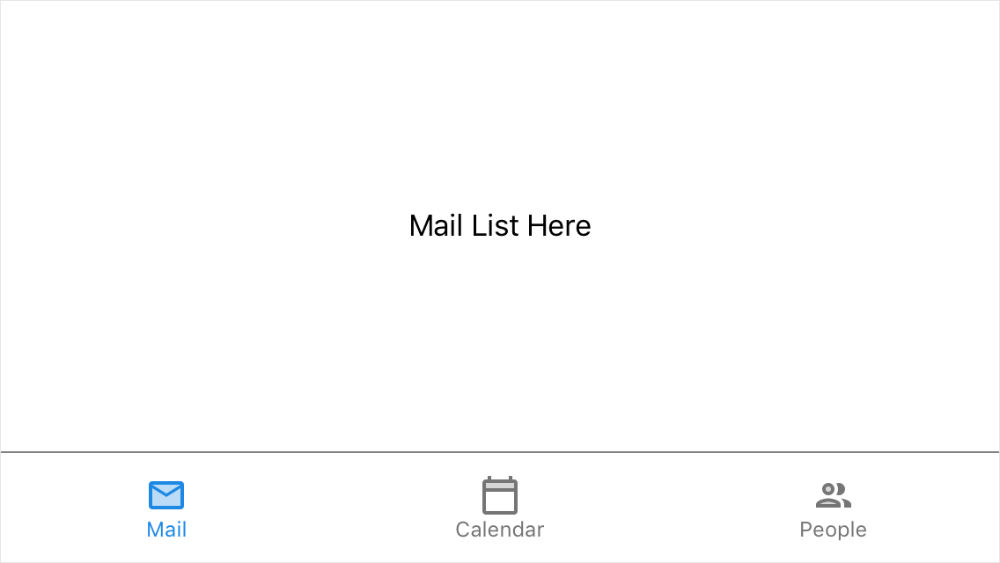

<!-- default badges list -->

<!-- default badges end -->
*Files to look at:*
* [MainPage.xaml](./CS/GettingStarted1/MainPage.xaml)

# Xamarin.Forms TabView: Getting Started Lesson 1

This example demonstrates how to create a bottom navigation bar with the [DevExpress TabView for Xamarin.Forms](https://docs.devexpress.com/MobileControls/DevExpress.XamarinForms.Navigation.TabView?v=19.2).
Refer to the [Create Tab Items Manually](https://docs.devexpress.com/MobileControls/400554/xamarin-forms/navigation-controls/getting-started/how-to-manually-populate-items?v=19.2) document for step-by-step instructions.

